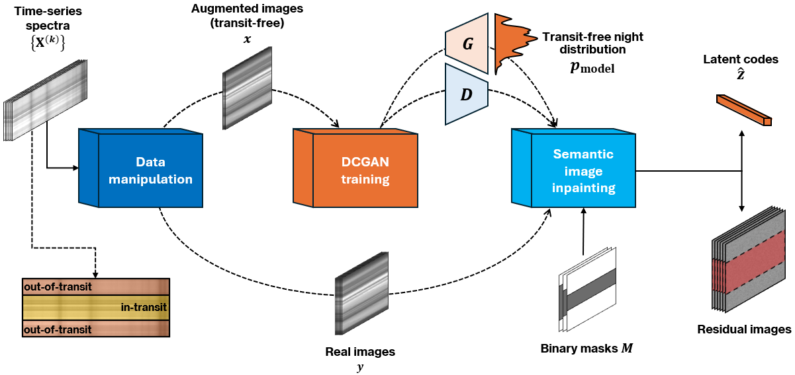
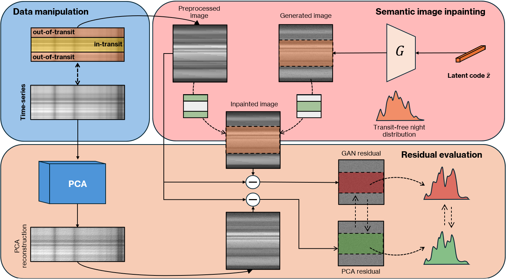

# GANASTRO: a data-driven approach for extracting exoplanetary atmospheric features
Official code repository for the paper "A data-driven approach for extracting exoplanetary atmospheric features" - M. Giordano Orsini _et al._, 2025



* Paper figures are stored in the folder ``paper/images`` and in ``experiments/inpainting`` subfolders.
* Experimental results are extracted from text files in ``experiments/comparison``.
* The file ``make_plots.py`` provides the code for reproducing some plots shown in the paper.


## Reproducing the experiments
We provide instructions in order to reproduce the experimental results of the proposed work.


### Installation

```
conda env create -f environment.yml
conda activate ganastro
```
### Data manipulation
_Prerequisite_: a set of real nights extracted from some data archive.

Launch ``augment.py`` for generating a synthetic dataset for model training.

### Training the DCGAN model
To train a DCGAN model, first you need to provide a configuration file. The json file ``dcgan.json`` contains the model specifications actually used for obtaining the experimental results proposed in the paper.
```
python train.py --config dcgan.json
```

In a time-limited session, you can resume the model training for a given checkpoint by using:
```
python train.py --resume <path-to-checkpoint> --config <path-to-config>
```

**N.B.:** To get a pretrained model or , please contact me at _massimiliano.giordanoorsini001@studenti.uniparthenope.it_ 

Please put the downloaded file in ``pretrained/``.

### Semantic image inpainting using DCGANs
Once trained, the generator $G$ approximates the distribution of transit-free nights, given the input real nights.

To perform _semantic image inpainting_, first you need to prepare a configuration file for the inpainting settings. The json file ``inpainting.json`` provides the inpainting configuration used in our work.

```
python inpaint.py --resume pretrained/0920_170346/checkpoint-epoch250.pth --config inpainting.json
```

## Running an experimental comparison with PCA

The following schema describes the comparison process between DCGAN and PCA-based detrending algorithm. More details in the paper.



We perform the PCA decomposition by computing the optimal number of principal components retaining the 90% of the total variance. However, this hyperparameter can be specified by setting the option ``--energy_threshold``.

To perform the comparison, launch:
```
python comparison.py --energy_threshold 90
```


